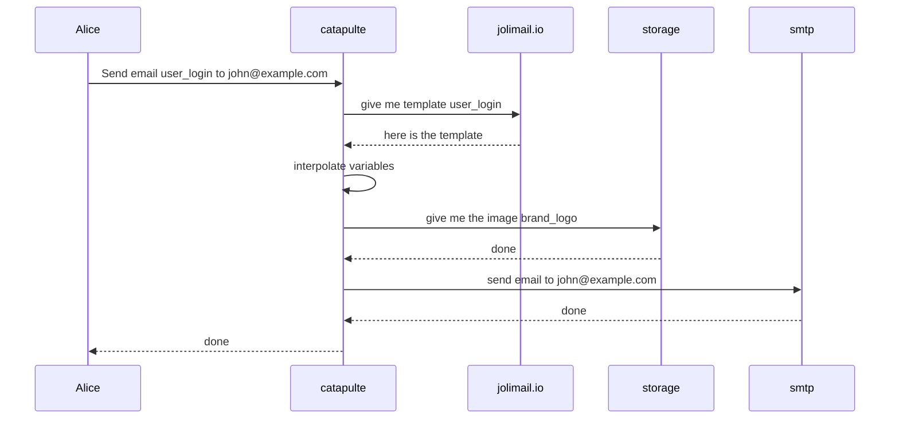
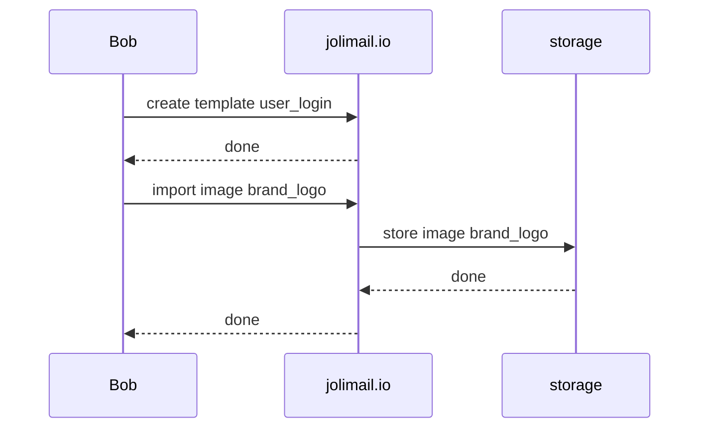

# Architecture

## Sending emails

The standard architecture is by using catapulte that you host in house and jolimail.io.

## Updating templates

The storage system can be:
- Minio (or anything implementing s3 api)
- local storage (file system)
